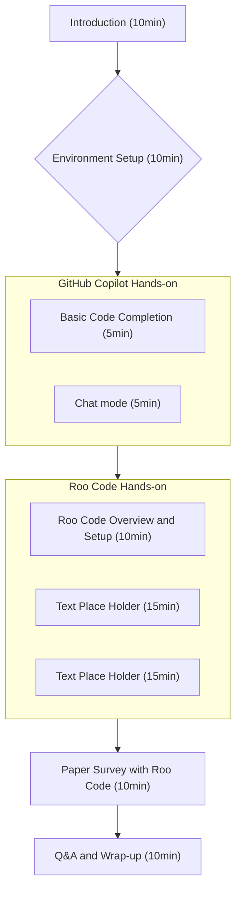

# AI Coding Workshop

This repository is designed for an AI coding workshop using GitHub Copilot and Roo Code.

## Workshop Overview

Learn how to effectively utilize AI coding assistance tools using Python.

## Requirements

- [Git](https://git-scm.com/)
- [uv](https://docs.astral.sh/uv/): Python package manager
- [ Visual Studio Code ](https://code.visualstudio.com/): Code editor
- [ GitHub Copilot subscription ](https://github.com/features/copilot): AI coding assistant service (requires GitHub account)
    - [GitHub Copilot](https://marketplace.visualstudio.com/items?itemName=GitHub.copilot) (vscode extension)
    - [GitHub Copilot Chat](https://marketplace.visualstudio.com/items?itemName=GitHub.copilot-chat) (vscode extension)
- [Roo Code](https://github.com/RooVetGit/Roo-Code) (vscode extension): AI coding agent extension

## Workshop Agenda (1.5 hours)

### 1. Introduction (10 minutes)
- Workshop objectives and goals
- Overview of AI coding tools
- Today's agenda

### 2. Environment Setup (10 minutes)
- Python environment verification
- VS Code extension installation check
- Sample repository preparation

### 3. GitHub Copilot Hands-on (10 minutes)

1. Basic Code Completion (5 minutes)
2. Chat mode (5 minutes)

### 4. Roo Code Hands-on (40 minutes)

1. Roo Code Overview and Setup (10 minutes)
2. Text Place Holder (15 minutes)
3. Text Place Holder (15 minutes)

#### 5. Paper Survey with Roo Code (10 minutes)

https://github.com/yutaka-shoji/surveyor

- Example of using Roo Code for paper survey

### 6. Q&A, Discussion (10 minutes)
- Participant questions
- Workshop review

## Flow Chart

